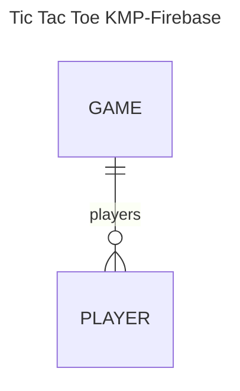

# TIC TAC TOE by SpBarber

This project is an Tic Tac Toe Application using KMP and Firebase Firestore as database.

## This is a structure of the database:

## And these are used classes:

### Game Entity

This entity has:

* gameId: String
* players: List<Player>
* playerTurn: Player
* board: List<Int>

### Player Entity

* playerId: String
* playerType: String

